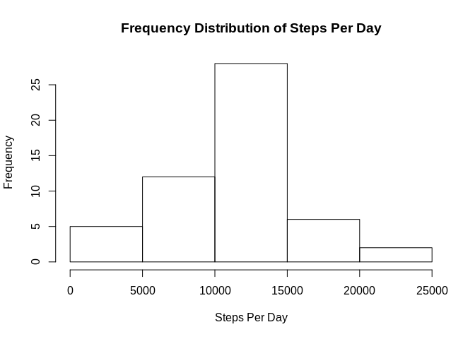
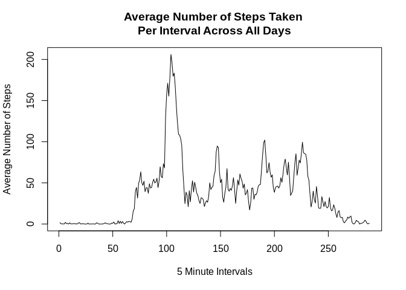
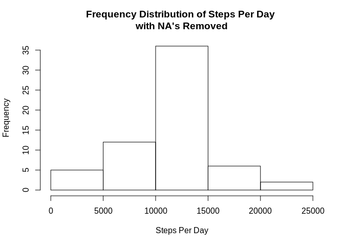
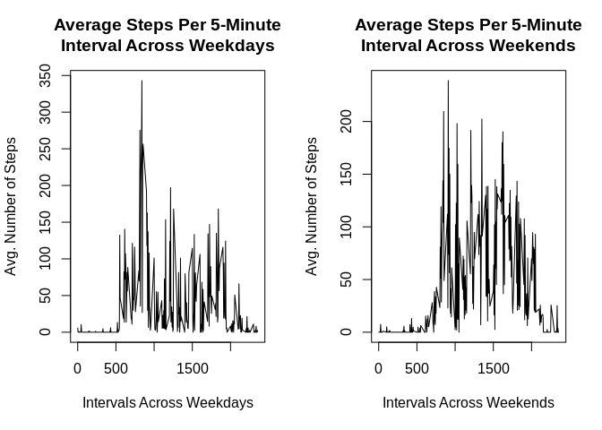

## A. Code for reading in the dataset and processing the data


```r
data1<-read.csv("activity.csv",sep=",",header=T)
str(data1)
```

```
## 'data.frame':	17568 obs. of  3 variables:
##  $ steps   : int  NA NA NA NA NA NA NA NA NA NA ...
##  $ date    : Factor w/ 61 levels "2012-10-01","2012-10-02",..: 1 1 1 1 1 1 1 1 1 1 ...
##  $ interval: int  0 5 10 15 20 25 30 35 40 45 ...
```

```r
mean(is.na(data1))*100
```

```
## [1] 4.371585
```

```r
data1$steps<-as.numeric(data1$steps)
data1$date<-as.Date(data1$date,format="%Y-%m-%d")
data1$interval<-as.factor(data1$interval)
```

## 1. Calculate the total number of steps taken per day


```r
sum(na.omit(data1$steps))
```

```
## [1] 570608
```

## 2. Histogram of the total number of steps taken each day


```r
steps<-tapply(data1$steps,data1$date,sum)
hist(steps,main="Frequency Distribution of Steps Per Day",
     xlab="Steps Per Day")
```

<!-- -->

## 3. Mean and median number of steps taken each day


```r
summary(data1$steps)
```

```
##    Min. 1st Qu.  Median    Mean 3rd Qu.    Max.    NA's 
##    0.00    0.00    0.00   37.38   12.00  806.00    2304
```

## 4A. Make a time series plot (i.e. type="l") of the 5-minute interval (x-axis) and the average number of steps taken, averaged across all days (y-axis)


```r
intervals1<-na.omit(data1)
intervals1<-tapply(intervals1$steps,intervals1$interval,mean)
intervals1<-as.table(intervals1)
intervals1<-as.data.frame(intervals1)
intervals1$Var1<-as.numeric(intervals1$Var1)
plot(intervals1$Var1,intervals1$Freq,type="l",
     main="Average Number of Steps Taken \nPer Interval Across All Days",
     xlab="5 Minute Intervals",
     ylab="Average Number of Steps")
```

<!-- -->

## 4B. Which 5-minute interval, on average across all the days in the dataset, contains the maximum number of steps?


```r
names(intervals1)<-c("Interval","AvgSteps")
head(intervals1[order(-intervals1$AvgSteps),],5)
```

```
##     Interval AvgSteps
## 104      104 206.1698
## 105      105 195.9245
## 107      107 183.3962
## 106      106 179.5660
## 103      103 177.3019
```

## 5. Calculate and report the total number of missing values in the dataset (i.e. the total number of rows with NAs)


```recho
sum(is.na(data1))
```

## 6. Code to describe and show a strategy for imputing missing data


```r
data2<-transform(data1,steps=ifelse(is.na(steps),mean(steps,na.rm=T),steps))
sum(is.na(data2))
```

```
## [1] 0
```

## 7. Histogram of the total number of steps taken each day after missing values are imputed


```r
steps2<-tapply(data2$steps,data2$date,sum)
hist(steps2,main="Frequency Distribution of Steps Per Day \nwith NA's Removed",
     xlab="Steps Per Day")
```

<!-- -->

## 8. Panel plot comparing the average number of steps taken per 5-minute interval across weekdays and weekends


```r
data1$Days<-weekdays(data1$date)
Wkdays<-data1[data1$Days==c("Monday","Tuesday","Wednesday","Thursday","Friday"),]
```

```
## Warning in data1$Days == c("Monday", "Tuesday", "Wednesday", "Thursday", :
## longer object length is not a multiple of shorter object length
```

```r
Wkends<-data1[data1$Days==c("Saturday","Sunday"),]
Wkdays<-na.omit(Wkdays)
Wkends<-na.omit(Wkends)
Wkdays1<-tapply(Wkdays$steps,Wkdays$interval,mean)
Wkends1<-tapply(Wkends$steps,Wkends$interval,mean)
Wkdays2<-as.data.frame(Wkdays1)
Wkends2<-as.data.frame(Wkends1)
Wkdays2$Inter<-row.names(Wkdays2)
Wkends2$Inter<-row.names(Wkends2)
par(mfrow=c(1,2))
plot(Wkdays2$Inter,Wkdays2$Wkdays1,type="l",
     main="Average Steps Per 5-Minute\nInterval Across Weekdays",
     xlab="Intervals Across Weekdays",
     ylab="Avg. Number of Steps")
plot(Wkends2$Inter,Wkends2$Wkends1,type="l",
     main="Average Steps Per 5-Minute\nInterval Across Weekends",
     xlab="Intervals Across Weekends",
     ylab="Avg. Number of Steps")
```

<!-- -->
